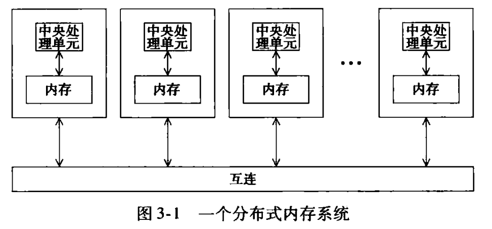
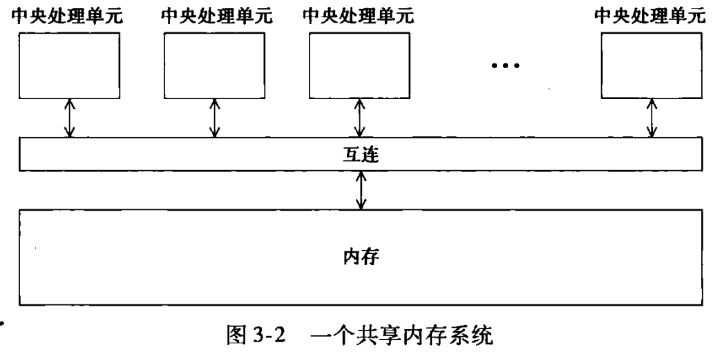
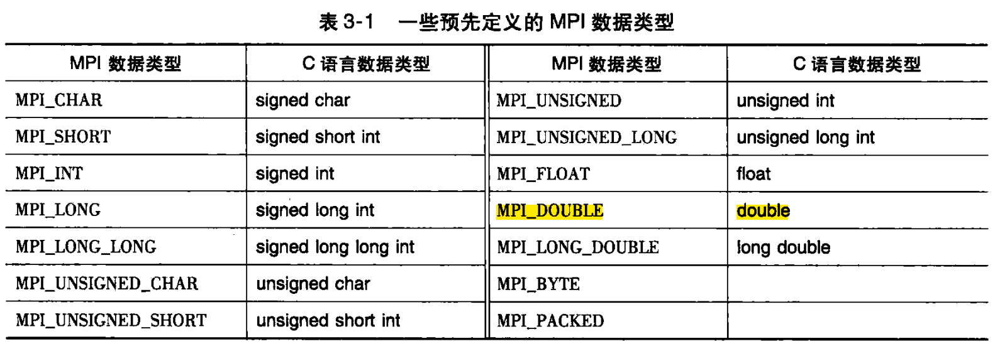

并行多指令多数据流计算机分为两种：
- 分布式内存系统
- 共享内存系统

从程序员角度来看, 分布式系统由网络连接的核 - 内存对的集合组成, 与核相关联的内存只能由该核访问, 如下图

共享内存系统由核的集合组成，所有核都连接到一个全局访问的内存, 且每个核可以访问内存的任意位置, 如下图


## 1 分布式内存系统

分布式内存系统通过 ==消息传递== 来编程. 在消息传递程序中，运行在一个核 - 内存对上的程序通常称为一个**进程**. 两个进程通过调用函数来通信: 一个进程调用发送函数, 另一个调用接受函数. 我们将使用消息传递的实现称为消息传递接口, 英文名字为 Message-Passing Interface, 简称 MPI. 总之, 在 C/C++/Fortran 中实现分布式内存编程便是通过调用 MPI 函数库实现的.

## 2 预备知识

### 2.1 编译与执行

>预备知识部分是围绕下面的 MPI 示例程序展开的。

```c
#include <stdio.h>
#include <string.h>
#include <mpi.h>
const int MAX_STRING = 100;
int main(void) 
{
	char greeting[MAX_STRING];
	int comm_sz;
	int my_rank;
	MPI_Init(NULL, NULL);
	MPI_Comm_size(MPI_COMM_WORLD, &comm_sz);
	MPI_Comm_rank(MPI_COMM_WORLD, &my_rank);
	if (my_rank != 0)// 如果进程号不是0，就干活，否则就负责通讯
	{
		sprintf(greeting, "Greetings form process %d of %d!", my_rank, comm_sz);
		MPI_Send(greeting, strlen(greeting) + 1, MPI_CHAR, 0, 0, MPI_COMM_WORLD);
	} else 
	{
		printf("Greetings from process %d of %d!\n", my_rank, comm_sz);
        for (int q = 1; q < comm_sz; q++)
        {
            MPI_Recv(greeting, MAX_STRING, MPI_CHAR, q, 0, MPI_COMM_WORLD, MPI_STATUS_IGNORE);
            printf("%s\n", greeting);
        }
    }
    MPI_Finalize();
    return 0;
}
```

一般系统上的编译指令为

```shell
mpicc -g -Wall -o mpi_hello mpi_hello.c
```

许多系统还支持使用 mpiexec 命令来启动程序

```shell
mpiexec -n <number of processes> ./mpi.hello
```

mpiexec 命令告诉系统启动 `<number of processes>` 个 `<mpi_hello>` 程序实例

### 2.2 MPI 程序

观察前面的例子得到

- c 中使用 MPI 需要使用 `mpi.h` 头文件
	- `mpi.h` 中包含了 MPI 函数的原形, 宏定义, 类型定义等
	- `mpi.h` 中还包含了编译 MPI 程序所需要的全部定义与声明
- 所有 MPI 定义的标识符都是由字符串 MPI_ 开始
	- 下划线后 ==第一个字母大写, 其余字母小写表示函数名和 MPI 定义的类型==
	- ==全部字母大写表示 MPI 定义的宏和常量==

### 2.3 MPI_Init 和 MPI_Finalize

#### 2.3.1 MPI_Init

> 调用 `MPI_Init` 是为了告知 MPI 系统进行所有必要的初始化设置. 例如, 系统可能需要为消息缓冲区分配存储空间, 为进程指定进程号等

语法结构为

```c
int MPI_Init(
int *argc_p,
char ***argv_p
);
```

参数 `argc_g` 和 `argv_p` 是指向参数 `argc` 和 `argv` 的指针, 当程序不使用这些参数时, 可以只是将它们设置为 `NULL`. 就像大部分的 MPI 函数一样, MPI_Init 返回一个 int 型错误码, 在大部分情况下, 我们忽略这些错误码.

#### 2.3.2 MPI_Finalize

> 调用 `MPI_Finalize` 是为了告知 MPI 系统, MPI 已经使用完毕, ==为 MPI 分配的任何资源都可以释放了==

语法结构为

```c
int MPI_Finalize(void);
```

#### 2.3.3 MPI 程序的基本框架

结合前面的 `MPI_Init ` 和 `MPI_Finalize` , 可以得出 MPI 程序的基本框架为

```c
#include<mpi.h>

int main(int argc, char* argv[]){
	/*No MPI calls before this*/
	MPI_Init(&argc,&argv);
	
	
	MPI_Finalize(void);
	/*No MPI calls after this*/
	return 0;
}
```

### 2.4 通信子, `MPI_Comm_size` 和 `MPI_Comm_rank`

>在 MPI 中, 通信子 (communicator) 指的是一组可以互相发送消息的进程集合

`MPI_Init` 会在用户启动程序时, 定义由用户启动的所有进程所组成的通信子, 这个通信子称为 `MPI_COMM_WORLD`. 我们可以通过两个函数从通信子中获取信息, 这两个函数分别是 `MPI_Comm_size` 和 `MPI_Comm_rank`, 其语法结构为

```c
int MPI_Comm_size(
	MPI_Comm comm, //in
	int *comm_sz_p //out
);
int MPI_Comm_rank(
	MPI_Comm comm, //in
	int *my_rank_p //out
);
```

- 这两个函数中, 第一个参数是一个通信子, 它所属的类型是 MPI 为通信子定义的特殊类型: `MPI_Comm`.
- `MPI_Comm_size` 函数在它的第二个参数中返回通信子的进程数.
- `MPI_Comm_rank` 函数在它的第二个参数里返回正在调用进程在通信子中的进程号.

>  在 `MPI_COMM_WORLD` 中经常用参数 comm_sz 表示进程的数量, 用参数 my_rank 来表示进程号

### 2.5 SPMD 程序

在前面的实例中，0 号进程本质上做的事情与其他进程不同。0 号进程所做的事，主要是当其他进程生成和发送消息时，它负责接收消息并打印出来。这在并行编程中很常见。事实上，大部分 MPI 程序都是这么写的。即，编写一个单个程序，让不同的进程产生不同的动作。实现方式是简单地让进程按照它们的进程号来匹配程序分支。这一方法称为**单程序多数据流（Single Program，Multiple Data，SPMD）**。

原则上来说，我们可以编写运行任意数量进程的程序，如果系统有足够资源，可以在 100 个，甚至 10 万个进程上运行。一般我们总是试着编写可以运行任意数量进程的程序，因为我们通常事先不知道可用资源到底有多少。并且，有的时候超算资源需要计费，于是我们需要先在本地 10 核的系统测试，然后提交到 1000 核的超算中运行。

### 2.6 通信

示例程序中
- 17 行和 18 行中，除了 0 号进程都产生了一条
- 19 行和 20 行代码将消息发送给 0 号进程

### 2.7 MPI_Send

`MPI_Send` 的语法结构为：

```c
int MPI_Send(
	void* msg_buf_p,
	int msg_size,
	MPI_Datatype msg_type,
	int dest,
	int tag,
	MPI_Comm communicator
);
```

- 前三个参数 `msg_buf` 、`msg_size` 和 `msg_type` 定义了消息的内容
	- `msg_buf` 是一个指向包含消息内容的内存块的指针
	- `mpi_size` 和 `mpi_type` 指定了要发送消息的数据量（在示例程序中，这两个参数一起告知了系统整个消息含有 `strlen(greeting)+1` 个字符）
- 后三个参数 `dest` 、`tag` 和 `communicator` 定义了消息的目的地
	- `dest` 指定了要接收消息的进程的进程号
	- `tag` 是个非负 `int` 型，用于区分看上去完全一样的消息
	- `communicator` 是一个通信子，所有涉及通信的 `MPI` 函数都有一个通信子参数，通信子最重要的目的之一是指定通信范围。**通信子指的是一组可以互相发送消息的进程的集合**。一个通信子中的进程所发送的消息不能被另一个通信子中的进程所接收。


>C 语言中的类型（`int`、`char` 等）不能作为参数传递给函数，所以 MPI 定义了一个特殊类型：`MPI_Datetype`



### 2.8 MPI_Recv

`MPI_Recv` 的语法结构

```c
int MPI_Recv(
	void* msg_buf_p,
	int buf_size,
	MPI_Datatype buf_type,
	int source,
	int tag
	MPI_Comm communicator,
	MPI_Status* status_p
);
```

- 前三个参数指定了用于接收消息的内存
	- `msg_buf_p` 指向内存块
	- `buf_size` 指定了内存块中存储对象的数量
	- `buf_type` 说明了对象的类型
- 后三个参数用来识别消息
	- `source` 指定了接收消息应该从哪个进程发送而来
	- `tag` 要与发送消息的参数 `tag` 相匹配
	- `communicator` 必须与发送进程所用的通信子想匹配
- `status_p` 在大部分情况下不使用，赋予其特殊的 `MPI` 常量 `MPI_STATUS_IGNORE` 就行了

### 2.9 消息匹配
