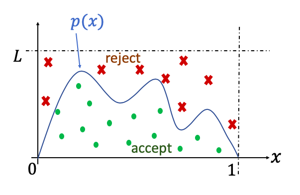
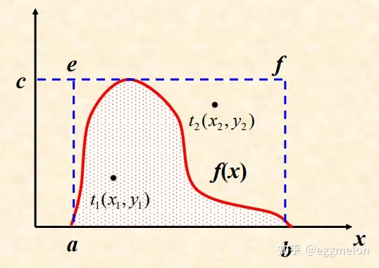
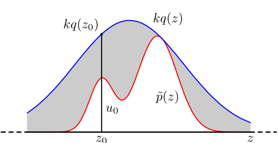
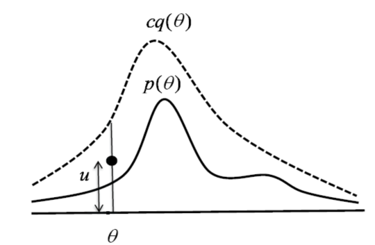
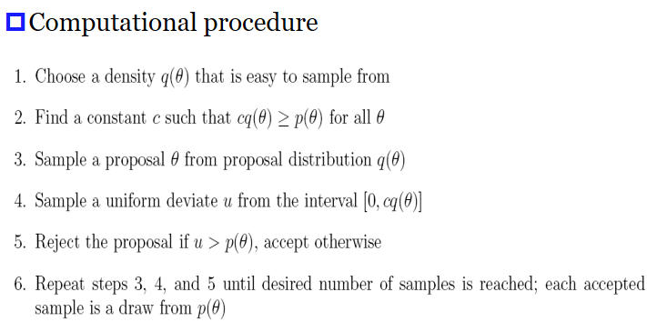

## 随机模拟的基本思想

假设我们有一个矩形区域 $R$，面积为 $S_{0}$。在此区域中，有一个不规则区域 $M$，其面积 $S$ 待求：

1. 将不规则区域 $M$ 划分为多个小的规则区域，由这些规则区域的面积总和 $S'$ 近似 $S$
2. 抓一把黄豆，均匀铺在 $R$ 中，再统计落在不规则区域 $M$ 中的黄豆比例，比例可近似为 $S/S_{0}$

方法 2 便采用了**抽样**解决问题的思想，也就是随机模拟

> 随机模拟的关键在于：
> 1. 如何将实际复杂问题，转换为可以抽样解决的问题
> 2. 如何利用计算机可以实现的均匀抽样，借助一些算法，得到满足特定概率分布 $p(x)$ 的抽样

这里主要关系第二点，即如何实现特定概率分布 $p(x)$

## 舍选抽样 (Acceptance-rejection sampling)

> 参考自：[Matlab和Python产生任意指定分布的随机数 - 知乎](https://zhuanlan.zhihu.com/p/405066589)

直接抽样算法的困难：
- 许多随机变量的累积分布函数无法用解析函数给出
- 有些随机变量的累积分布函数不存在或难以求出
- 即使反函数存在，但依然计算困难

> 舍选抽样法 (von Neumann)： 抽取随机变量 $x$ 的一个随机序列 $x_{i}(i=1,2,\dots,)$ 按一定的舍选规则从中选出一个子序列，使其满足给定的概率分布

设随机变量 $x$ 的取值区间为 $[a,b]$，其概率密度函数 $f(x)$ 有界，即

$$
max\{f(x)|a\leq x \leq b\} = c
$$

舍选抽样的步骤为

1. 产生 $[a,b]$ 区间内均匀分布的随机数 $x$
2. 产生 $[0,c]$ 区间内均匀分布的随机数 $y$
3. 当 $y\leq f(x)$ 时，接受 $x$ 为所需的随机数，否则，返回第一步重新抽取一对 $(x,y)$

### 几何解释

- 在二维图上，随机选取位于矩形 $abed$ 内的点 $(x,y)$
- 选取位于曲线 $f(x)$ 下的那些点，则这些点将服从概率密度为 $f(x)$ 的分布

### 证明

$x$ 和 $y$ 的概率密度函数分别为

$$
g_s(x)=\frac{1}{b-a}, \quad g_s(y)=\frac{1}{c}
$$

联合概率密度函数为

$$
g(x, y)=g_s(x) \cdot g_s(y)=\frac{1}{(b-a) c}
$$

舍选抽样法抽出的随机数 $d$ 的概率

$$
p(x \leq d \mid y \leq f(x))=\frac{\int_a^d \int_0^{f(x)} g(x, y) d x d y}{\int_a^b \int_0^{f(x)} g(x, y) d x d y}=\int_a^d f(x) d x=F(d)
$$

即 $d$ 的概率函数为 $f(x)$

### 抽样效率

如果选取某特定分布的一个随机数 $\xi$ 平均地需要 $n$ 个随机数 $r_1 \in U[0,1]$，则定义抽样效率为

$$
E=\frac{1}{n}
$$

对舍选抽样，欲产生 $m$ 个随机变量 $x$ 的值需产生 $n$ 对 $(x,y)$，显然，$m\leq n$

$$
E=\frac{m}{2 n}=\frac{\int_a^b f(x) d x}{2(b-a) c}=\frac{1}{2(b-a) c}
$$

### 高效舍选抽样

> 从均匀分布中提取目标分布效率较低，我们要如何改进算法？

一个思路便是：利用与目标分布接近的分布来舍选

图中蓝线是高斯分布，红线是目标分布，我们现在要利用高斯分布来得到目标分布。

大致原理是，

1. 假设我们的目标概率密度函数是 $p(\theta)$ 
2. 那么我们首先需要找到一个常数 $c$，和一个已有产生算法的概率密度 $q(\theta)$
3. 对 $c$ 的要求是将 $q(\theta)$ 放到到包住 $p(\theta)$
4. 接下来利用 $q(\theta)$ 产生足够多的随机数，对于某一个具体的值 $\theta_{0}$，我们可能会得到 100 个
5. 同时，我们可以依照 $c\cdot q(\theta_{0})$ 的值，为这 100 个 $\theta_{0}$ 设置编号 $u$，$u$ 是区间 $[0,c\cdot q(\theta_{0})]$ 上均匀分布的随机数
6. 只接受 $u\leq p(\theta)$ 的 $\theta_{0}$

具体步骤如下

